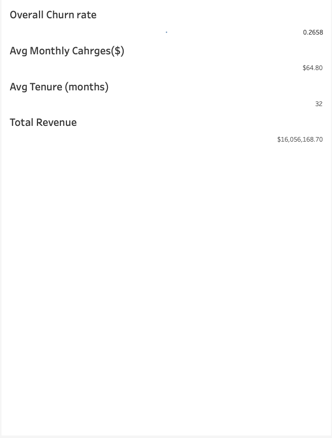
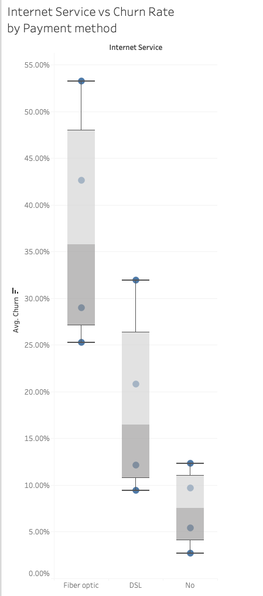
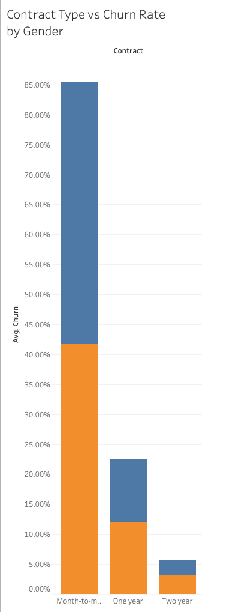
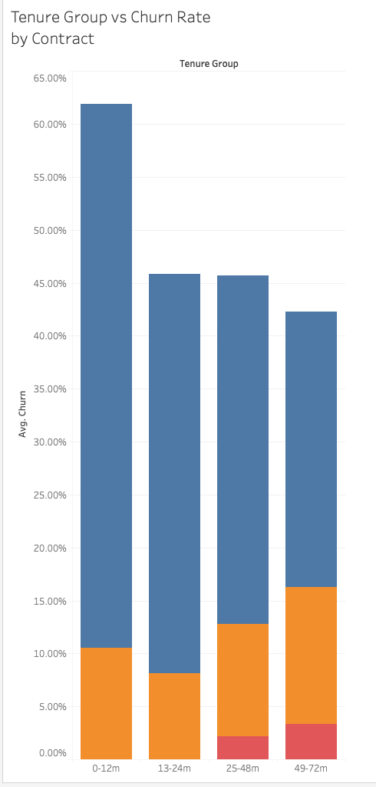
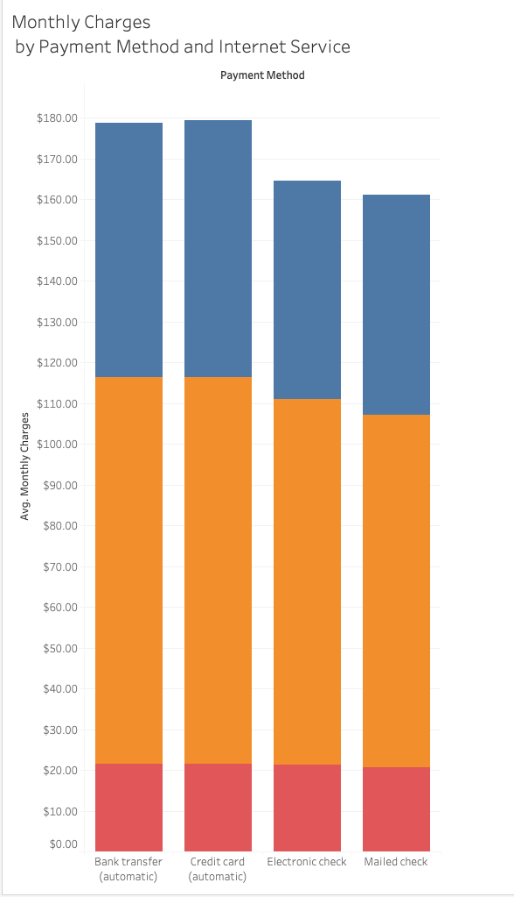

# 📊 Customer Churn Analysis & Prediction Dashboard

This project simulates a full analytics pipeline to analyze customer churn behavior using OLAP-style exploration, predictive modeling with PyTorch, and an interactive Tableau dashboard.

---

## 🚀 Overview

This project aims to identify key drivers of customer churn in a telecom company and provide business-friendly insights using statistical analysis and machine learning. The project demonstrates:

- Data cleaning and warehouse-style dimensional modeling
- OLAP exploration (churn rates by contract, internet service, tenure, etc.)
- Predictive churn classification using a neural network (PyTorch)
- Key KPIs and trends visualized using Tableau

---

## 🧰 Tools Used

- **Python** (pandas, PyTorch, scikit-learn, SMOTE)
- **Tableau Public** for dashboards
- **GitHub** for version control and documentation

---
## 🧱 Project Structure

📁 Customer-Churn-Analysis/  
│  
├── churn_analysis.ipynb       # Full notebook: cleaning, EDA, modeling  
├── cleaned_telco_churn.csv    # Final cleaned dataset for Tableau  
├── WA_Fn-UseC_-Telco-Customer-Churn (1).csv    # Initial data from Kaggle  
├── /tableau_screenshots/                   # Tableau screenshots for GitHub preview  
│   ├── KPI_churn_rate.png
│   ├── churn_by_contract.png
│   ├── churn_by_gender.png  
│   ├── churn_by_internet_type.png
│   └── monthly_charges.png
└── README.md

---

## 🔍 OLAP-Style Exploration (Examples)

- **Churn Rate by Contract Type**  
  → Compared churn rates across `Month-to-month`, `One year`, and `Two year` contracts.  
  → Found that short-term (Month-to-month) customers churned the most.

- **Churn by Internet Service**  
  → Analyzed churn by service type: `DSL`, `Fiber optic`, or `No internet`.  
  → Fiber optic users had the highest churn rate.

- **Churn by Tenure Group**  
  → Created tenure buckets: `0–12m`, `13–24m`, `25–48m`, `49–72m`.  
  → Longer-tenure customers churned significantly less.

- **Monthly Charges Bucket Analysis**  
  → Grouped customers into pricing tiers: `Low`, `Medium`, `High`.  
  → Higher monthly charges correlated with higher churn.

  ---

## 🤖 Predictive Modeling

The classification model was built with PyTorch and achieved:

- **Accuracy:** ~79%
- **F1-score for churners:** ~0.58
- **Balanced performance** using SMOTE and weighted loss

---

## 📈 Tableau Dashboard

The Tableau dashboard summarizes:

- KPI: Overall churn rate (%)
- KPI: Average monthly charges
- Visualizations by customer segments

---

## 📚 Data Source

- [Telco Customer Churn Dataset (IBM Sample)](https://www.kaggle.com/datasets/blastchar/telco-customer-churn)

---

## ✍️ Author

Seokhyun Yoon (Sean)  
[LinkedIn](https://www.linkedin.com/in/seokhyun-yoon-241a61104/) | [GitHub Portfolio](https://github.com/SeanYooon/Data-Analysis-Portfolio-)

---
